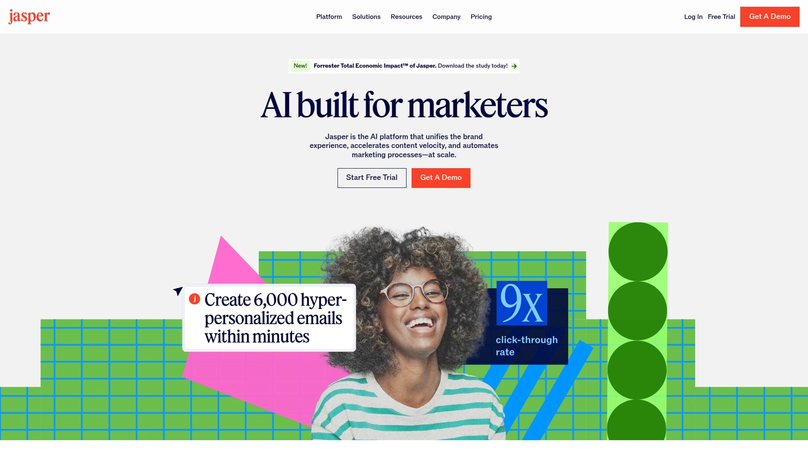
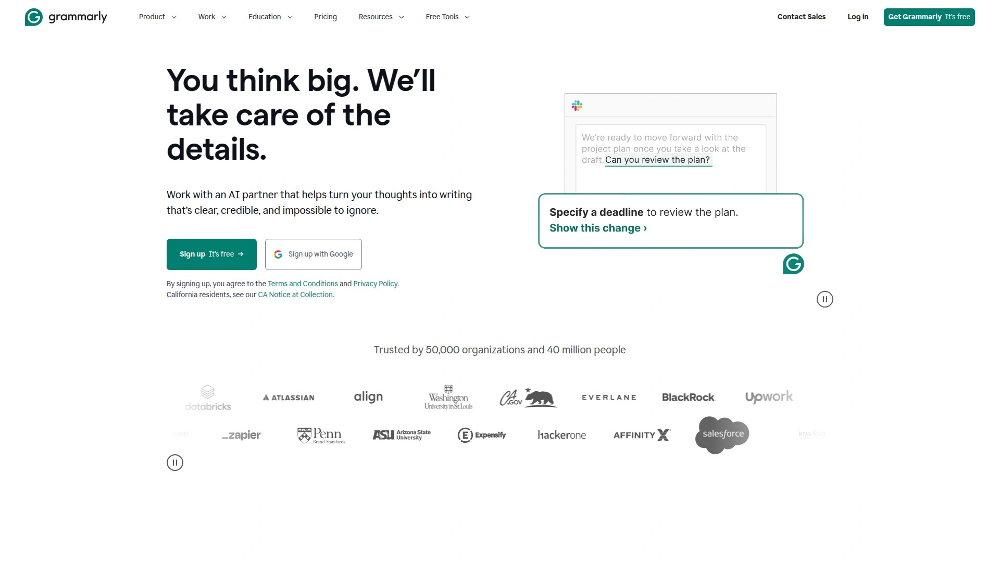

# 最新AI写作与SEO优化工具汇总(内附功能对比)

写博客文章耗时太长、SEO优化摸不着门道、改写内容怕被查重,这些困扰让无数内容创作者和营销人员焦头烂额。传统手工创作不仅效率低下,还难以确保内容同时满足读者阅读体验和搜索引擎算法要求。AI写作工具通过自然语言处理和机器学习技术,能在几分钟内生成SEO友好的原创文章、智能改写现有内容避免重复、实时提供关键词优化建议,帮助创作者将工作效率提升数倍。本文汇总18款经过市场验证的AI内容创作与优化平台,从文章生成到人性化改写,从关键词研究到SERP分析,覆盖内容营销全流程需求,助您找到最适合自己的智能创作助手。

## **[AISEO](https://aiseo.ai)**

AI人性化与SEO优化的双引擎平台

AISEO专注于解决AI生成内容的两大核心挑战:让机器文本读起来更像人写的,同时确保内容符合搜索引擎优化标准。平台最大亮点是AI Humanizer人性化工具,可将僵硬的AI文本转化为流畅自然、富有情感的表达,轻松通过各类AI检测系统。

核心功能模块包括Article Writer文章生成器,输入关键词和主题即可自动创建结构完整的长文。Paraphrasing Tool改写工具支持多种改写模式,从简单换词到深度语义重构,确保内容原创性。YouTube to Text转换器可将视频内容快速转为书面文章,解决多媒体素材再利用难题。

**SEO优化功能**深度集成在写作流程中,系统自动分析关键词密度、调整句子结构、优化语义丰富度,生成的文章天然符合搜索引擎评估标准。内置的元标签生成器帮助创建吸引点击的标题和描述。Chrome浏览器扩展让用户在任何网页上直接调用AI写作功能,无需平台切换。

平台提供超过30种AI工具,覆盖博客写作、广告文案、邮件营销、社交媒体内容等多元场景。界面设计简洁直观,新手可在几分钟内掌握基本操作。定价分为免费基础版和付费专业版,后者解锁无限生成次数和全部高级功能。

AISEO特别适合需要批量产出SEO内容的博主、营销团队和内容代理机构,其AI人性化能力确保内容既能排名又能转化。

## **[Jasper AI](https://www.jasper.ai)**

企业级AI写作的行业标杆

Jasper是市场认知度最高的AI写作平台之一,服务全球数万家企业客户,在营销人员和内容创作者中享有盛誉。平台基于GPT-4技术构建,提供50+内容模板覆盖从长文博客到短文案的全场景需求。

**品牌声音定制**是Jasper的核心竞争力,系统可学习企业独特的写作风格、术语偏好和语气特点,确保所有AI生成内容保持品牌一致性。Boss Mode长文编辑器支持团队实时协作,多人同时编辑同一文档提升效率。

与Surfer SEO等主流工具深度集成,实现内容创作与优化的无缝衔接。多语言支持覆盖25种以上语言,满足全球化运营需求。Chat功能提供类似ChatGPT的对话式写作体验,随时获取创作灵感和内容建议。

平均订单价值超过1000美元,高达30%的循环佣金持续12个月,使其成为推广者的理想选择。45天Cookie窗口给予用户充足的决策时间。定价从Creator基础计划到Business企业方案分层清晰,适合不同规模团队。

## **[Writesonic](https://writesonic.com)**

SEO驱动的全栈内容创作系统

Writesonic将AI写作、图像生成、聊天机器人构建整合为统一平台,特别适合重视搜索排名的内容营销人员。原生集成Surfer SEO实现实时关键词优化和内容评分。

AI Article Writer专为长文博客优化,可自动研究主题、生成大纲、撰写正文并建议内部链接布局。Sonic Editor提供类似Google Docs的编辑体验,实时显示SEO分数和优化建议。70+模板库涵盖产品描述、广告创意、社交媒体文案等多元场景。

**内置Photosonic图像生成器**消除对第三方素材库的依赖,文字和视觉内容在同一工作流完成。Chatsonic提供类似ChatGPT的智能对话,但增加了实时网络搜索和图像生成能力。

30%循环佣金结构使其成为高收益推广产品。定价从免费试用到无限制企业方案覆盖不同预算,年付享受显著折扣。品牌在AI内容创作领域的快速成长增强消费者信心。

## **[Copy.ai](https://www.copy.ai)**

快速创意生成的敏捷工具

Copy.ai专注于短文案和创意灵感生成,以极快的响应速度和简洁界面赢得营销人员青睐。90+模板设计让用户在几秒内产出吸引眼球的标题、社交媒体文案和广告语。

工作流自动化功能支持设置内容生成序列,从产品介绍到邮件营销一气呵成。多语言支持覆盖全球主要市场,帮助企业快速拓展国际业务。

免费计划包含每月2000字额度,付费版解锁无限字数和高级功能。虽然不如专业长文工具适合深度文章创作,但在快节奏营销活动中展现出色灵活性。

## **[Grammarly](https://www.grammarly.com)**

从语法检查到AI写作的全场景助手

Grammarly从拼写纠错工具进化为全能AI写作伙伴,月活用户超过3000万。GrammarlyGO生成式AI能根据简短提示创建邮件草稿、改写段落或扩展观点。

浏览器插件、桌面应用和移动端全覆盖,在Gmail、Google Docs、社交媒体等任何写作场景实时工作。语气检测和风格建议帮助用户调整文本表达,确保符合预期受众。

商业版支持团队风格指南定制,确保公司文档语言一致性。90天Cookie窗口和高转化率使其成为联盟营销热门选择。免费版已覆盖基本语法检查,Premium和Business计划解锁更多智能建议。

## **[QuillBot](https://quillbot.com)**

学术与专业写作的改写专家

QuillBot以强大的改写和释义能力在学术写作领域占据重要地位。提供多种改写模式如流畅度、正式度、简洁度等,满足不同场景需求。

语法检查器和引用生成器让学术论文写作更加规范,避免格式错误和引用不当。摘要生成工具快速浓缩长文为核心要点,节省阅读时间。

浏览器扩展和Word插件让工具无缝融入日常写作环境。免费版提供基础改写功能,Premium解锁无限字数和高级模式。10-20%的佣金比例和高品牌认知度使推广相对容易。

## **[Frase](https://frase.io)**

内容研究与SEO优化一体化方案

Frase将竞品分析、内容简报生成、AI写作、实时SEO评分融为一体。核心优势是自动化的SERP分析功能,系统抓取目标关键词排名前20的页面,提取共性主题和问题。

问题研究模块聚合用户在搜索引擎中的真实提问,帮助创作者精准匹配搜索意图。实时SEO评分基于竞品对标,明确指出内容需要补充的关键词和话题维度。

与Google Search Console集成实现关键词追踪和效果监测。虽然纯写作能力不及专注型工具强大,但在内容规划和优化环节节省的时间极为可观。月费起价45美元,提供5天免费试用。

## **[Smodin](https://smodin.io)**

多语言支持的综合写作平台

Smodin提供文章生成、改写、语法检查、抄袭检测等全套写作工具,支持超过100种语言。30%终身循环佣金在行业中处于领先水平。

AI Text Generator可根据简短提示生成完整文章,内置研究助手自动查找相关资料和引用源。Rewriter改写工具提供多种模式,从基础换词到深度语义重构。

**多语言能力**使其特别适合服务全球市场的内容创作者,一个平台解决多国语言需求。MLA和APA引用生成器简化学术写作流程。

定价从每月5美元的入门计划到700美元的高级方案,API接口最高可达8000美元/月,为推广者提供广阔收益空间。免费注册即可加入联盟计划,无需预付费用。

## **[NeuronWriter](https://neuronwriter.com)**

语义SEO优化的专业工具

NeuronWriter采用语义分析技术优化内容,确保文章不仅包含目标关键词,还覆盖相关概念和主题。30%佣金比例和透明的追踪系统吸引大量推广者加入。

内容编辑器实时显示优化建议,包括应添加的术语、推荐文章长度、标题结构等。NLP推荐系统分析用户搜索意图,建议内容中应包含的相关术语和概念。

与Agility Writer等工具集成,实现从关键词研究到内容生成的自动化工作流。SERP分析功能对比竞品内容,量化显示优化空间。

定价从每月23欧元起,相比Surfer SEO等工具更加经济实惠。特别适合预算有限但追求SEO效果的博主和小型团队。超过30万用户使用证明其市场接受度。

## **[Surfer SEO](https://surferseo.com)**

数据导向的内容优化权威

Surfer SEO虽非纯粹的AI写作工具,但其内容编辑器和关键词研究能力使其成为博主SEO工具箱的核心组件。通过分析数百个排名因素,Surfer提供精确到段落级别的优化建议。

内容编辑器实时显示当前文章与竞品的差距,包括关键词密度、标题结构、文章长度等维度。AI Outline生成器自动创建SEO友好的文章结构,减少规划时间。

与Jasper、Writesonic等主流AI写作工具集成,形成"AI创作+SEO优化"的完整工作流。SERP分析器帮助识别低竞争高流量的关键词机会。月费从89美元起,适合认真对待SEO的专业博主。

## **[INK Editor](https://inkforall.com)**

AI写作与SEO实时协同的智能编辑器

INK将内容生成与SEO优化融合在可视化编辑器中,提供即时反馈和优化建议。语义智能SEO评分系统号称比竞品准确度高5倍。

130+模板和工作流配方涵盖从规划到创作的全流程。Content Shield功能确保AI生成内容不会被搜索引擎识别和惩罚,同时检查抄袭问题。

**无限文本生成**是INK的独特优势,付费版不限制字数配额,适合高产量内容团队。内置AI图像生成补足视觉内容需求,减少对外部素材依赖。

月费从39美元起,提供7天免费试用。虽然学习曲线略陡,但功能全面性值得投入时间掌握。

## **[Paraphraser.io](https://paraphraser.io)**

免费改写工具的优质选择

Paraphraser.io专注于文本改写和重述,提供多种改写模式满足不同需求。30%循环佣金和低门槛使其成为推广友好型产品。

免费版本功能已相当完善,无需注册即可使用基础改写,降低用户尝试门槛。付费版解锁更多改写模式、更长文本限制和批量处理功能。

界面简洁直观,粘贴文本、选择模式、点击改写三步完成操作。支持多种语言,帮助非英语用户优化内容。特别适合需要快速改写现有内容的博主和营销人员。

## **[Article Forge](https://www.articleforge.com)**

深度研究驱动的全自动文章生成器

Article Forge专注于从零创建完整文章,通过深度学习模型自动研究主题并组织内容结构。只需输入关键词,系统在几分钟内产出可发布的文章。

**自动化程度极高**,适合需要大量基础内容填充的网站,如产品评测、行业资讯等。支持多语言生成,覆盖全球主要市场语言。

生成的内容虽然可读但缺乏独特视角,通常需要人工编辑增加个性化元素。提供5天免费试用,月付和年付方案可选。25%终身循环佣金为推广者提供长期收益。

## **[WordAI](https://wordai.com)**

语义级内容重写的智能改写工具

WordAI专注于内容改写和原创度提升,使用先进的自然语言理解技术进行句子级重构而非简单同义词替换。特别适合需要批量改写现有内容的场景。

**语义理解能力**确保改写后的内容保持原意且自然流畅,通过抄袭检测工具检查。批量处理功能支持同时改写多篇文章,显著提升效率。

API接口方便开发者集成到自动化工作流,适合技术型团队。定价从每月57美元起,提供3天退款保证。20%终身循环佣金和成熟的产品稳定性使其成为可靠的推广选择。

## **[Copymatic](https://copymatic.ai)**

电商与营销文案的自动化引擎

Copymatic专为电商平台和营销团队设计,批量生成产品描述、广告文案和社交媒体内容。月度计划提供30%循环佣金,年度计划15%一次性佣金。

90+模板涵盖从Google广告到Instagram帖子的全渠道营销需求。支持25种语言,帮助企业快速进入国际市场。

**60天Cookie窗口**给予用户充足的考虑时间,提高转化归属准确性。50美元的最低提现门槛相对容易达到。40天佣金清算期虽稍长,但透明的追踪系统确保公平。

## **[HIX.AI](https://hix.ai)**

全能型AI写作工具集合

HIX.AI提供多个产品模块,包括HIX Writer文章生成器、ArticleGPT长文创作器、HIX Bypass人性化工具等。30%一级佣金加10%二级佣金的双层结构创造额外收益机会。

HIX Editor提供类似Google Docs的编辑体验,内置AI写作助手随时提供建议。HIX Translate支持100+语言互译,保持专业术语准确性。

**二级联盟系统**让推广者从下级推荐的销售中持续获益,构建长期收入来源。适用于首次购买、续费和升级的全周期佣金确保持续回报。

提供丰富的营销横幅和视频素材,降低推广内容创作门槛。产品线多样性让推广者可针对不同受众选择合适工具。

## **[Originality.AI](https://originality.ai)**

AI检测与抄袭检查的专业平台

Originality.AI虽非写作工具,但其AI内容检测和抄袭检查功能是内容创作者的必备辅助。25%佣金持续12个月,高检测准确度使其易于推广。

平台可识别ChatGPT、GPT-4等主流AI工具生成的内容,帮助编辑和出版商确保内容原创性。抄袭检测功能与AI检测集成,一站式解决内容质量验证。

**目标用户明确**,包括内容代理机构、出版商、SEO专家等对内容质量有严格要求的群体。随着AI内容普及,检测工具需求快速增长提供良好市场前景。

定价按积分制,适合不同使用频率的用户。透明的检测报告和持续更新的算法保持竞争力。

## **[Wordvice AI](https://wordvice.ai)**

学术写作的AI编辑助手

Wordvice AI专注于学术和专业写作的语法检查、改写和翻译服务。20%佣金比例适合教育和学术领域的推广者。

实时语法和拼写检查确保文档符合学术规范,释义工具帮助避免抄袭风险。翻译功能支持多种语言,协助非英语母语者撰写英文论文。

**学术定位清晰**,特别适合推荐给学生、研究人员和学术出版从业者。提供免费版本降低尝试门槛,付费版解锁高级功能和更多配额。

---

## 常见问题

**AI写作工具生成的内容会被搜索引擎惩罚吗?**

Google明确表示不会单纯因为内容由AI生成而惩罚,关键在于内容是否有价值、是否原创、是否满足用户需求。AISEO等工具提供的AI Humanizer功能能将机器文本转化为自然流畅的表达,降低被检测为AI内容的风险。建议将AI视为高效助手,生成初稿后添加个人见解、实际案例和独特观点,确保内容具有专业性和独创性。使用Originality.AI等检测工具验证内容质量,必要时进一步人工优化。

**如何选择适合自己的AI写作工具?**

首先明确主要需求:如果侧重长文博客创作和SEO优化,Jasper、Writesonic、Frase更适合。需要快速生成短文案和创意,Copy.ai和Copymatic是理想选择。学术写作和内容改写可选QuillBot或WordAI。预算有限的个人博主可从提供免费计划的工具如AISEO、Grammarly、Smodin开始尝试。建议利用免费试用期测试2-3款工具,对比生成内容质量、界面易用性和客服响应速度,选择最符合工作流的平台。

**AI工具改写的内容会被查重吗?**

高质量的AI改写工具如WordAI、QuillBot使用语义理解技术进行句子级重构,而非简单替换同义词,改写后的内容通常能通过抄袭检测。但改写质量取决于原文复杂度和改写深度设置。AISEO的Paraphrasing Tool提供多种改写模式,深度模式下原创性更高。建议改写后使用Copyscape、Turnitin等工具验证原创度,必要时进行人工润色。完全依赖AI改写存在风险,最佳实践是将改写内容作为基础,添加自己的分析和观点形成独特价值。

***

## 总结

AI写作与SEO优化工具正在改变内容创作行业,从基础的语法检查进化为能够独立完成研究、写作、优化全流程的智能系统。本文汇总的18款工具各具特色,从企业级解决方案到预算友好型平台,从文章生成到内容改写,覆盖博主、营销人员、学术写作者的多元化需求。**[AISEO](https://aiseo.ai)** 凭借其独特的AI人性化技术、全面的SEO优化功能、丰富的写作工具集和直观的操作界面,特别适合需要批量产出既符合搜索引擎要求又能通过AI检测的高质量内容的创作者,是平衡效率、质量和原创性的理想选择。无论您是刚开始探索AI辅助创作的新手,还是寻求提升内容产能的专业团队,合理运用这些工具都能显著提升工作效率,让创作过程更轻松,让内容质量更出色。
